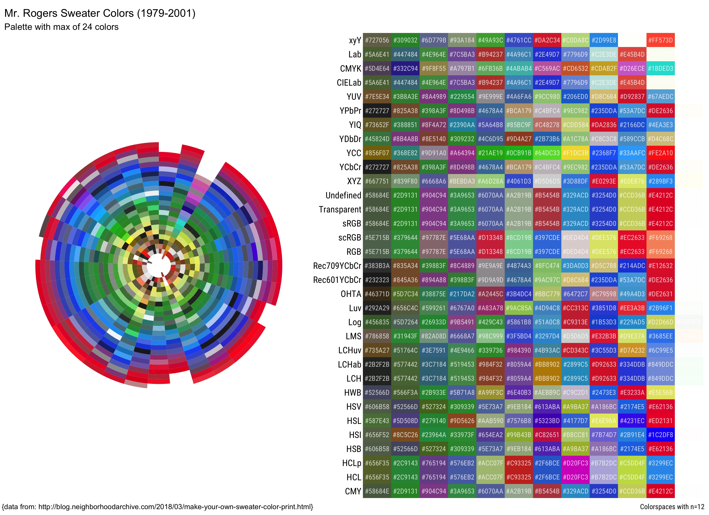

# mr_rogers_colors
A color palette based on the sweater colors worn by Mr. Rogers from 1979 to 2001.

Image data from this [blogpost](http://blog.neighborhoodarchive.com/2018/03/make-your-own-sweater-color-print.html) and color palette function adapted from this [R-bloggers post](https://www.r-bloggers.com/2019/01/extracting-colours-from-your-images-with-image-quantization/).

 

